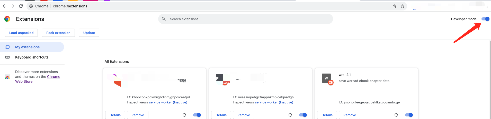

# jsoncracker

Crack the [jsoncrack](https://pro.jsoncrack.com/) pro editor.

## 安装
从 [Release 页面](https://github.com/jooooock/jsoncracker/releases)下载最新版本的 jsoncracker.zip 并解压，然后打开 Chrome 插件管理页面(chrome://extensions/)，如下：

打开右上角的开发者模式，然后在左上角的 **Load unpacked** 按钮安装该插件。

安装后的效果如下：

## 使用
安装完之后启用该插件，然后直接访问 https://pro.jsoncrack.com/editor 即可。
